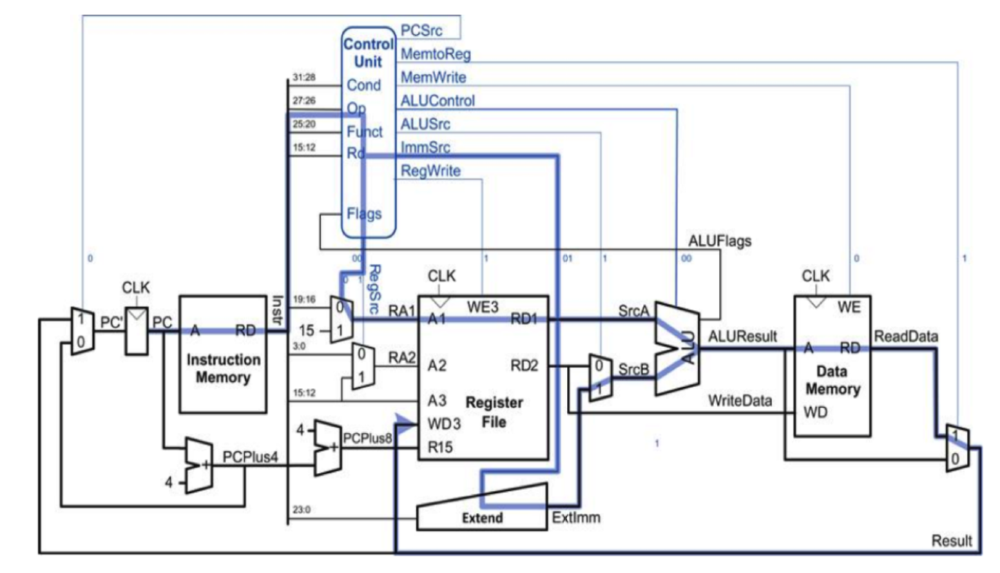

# ARMv4 Processor Architecture 

## Implementation

32-bit load/store architecture with Harvard-style organization
using an FPGA in System Verilog. The key components of the processor are 

* Instruction Memory
* Register File
* ALU
* Data Memory
* Program Counter 
* Controller

Addition was implemented using carry lookahead adders. 

## Instructions
The following instructions were implemented:

* ADD (add)
* LDR (load)
* STR (store)
* B   (branch)
